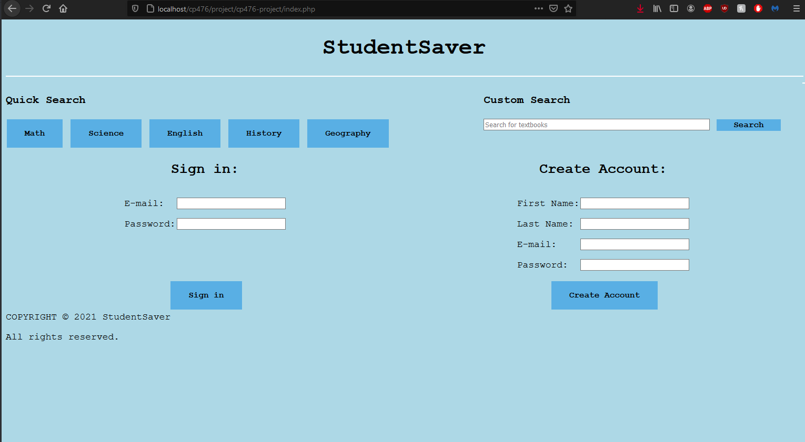
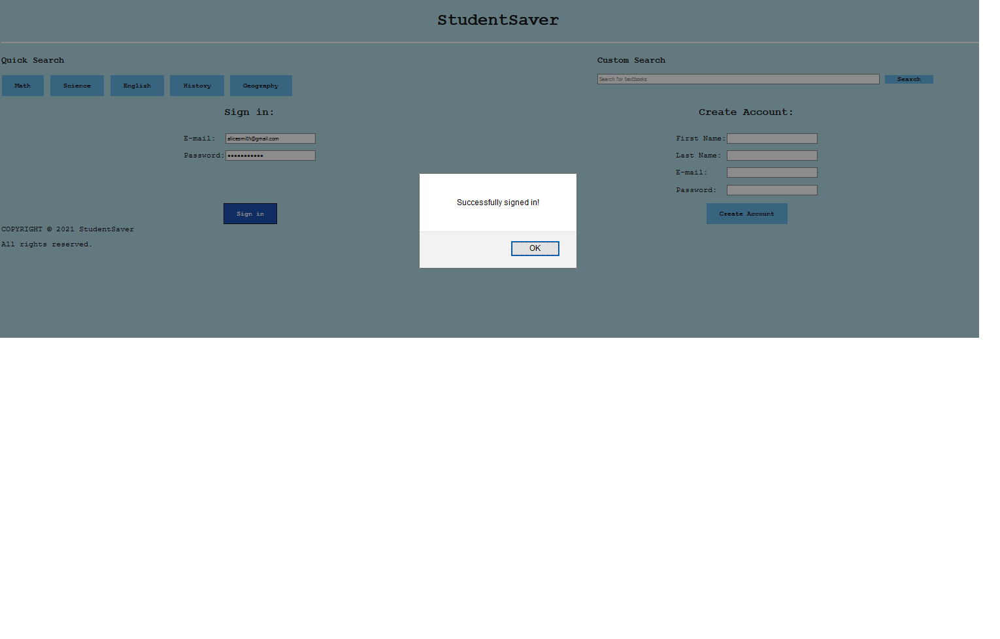
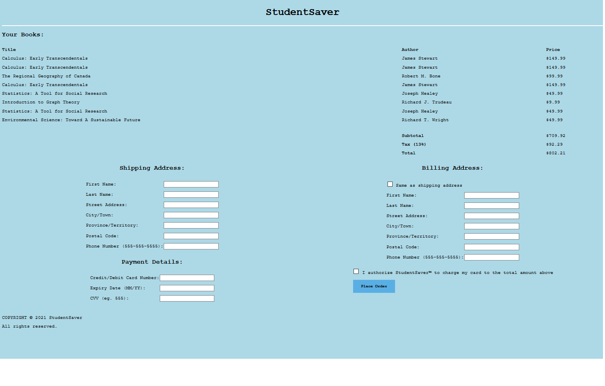
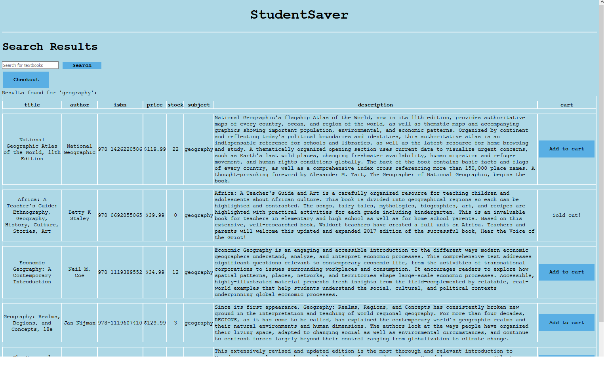
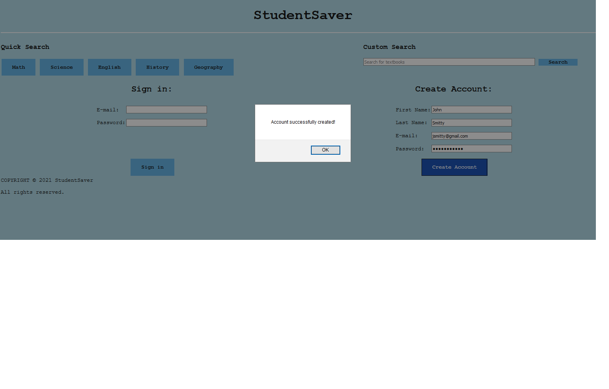

# A1 Report

Author: Rob Fedorowicz, Hayden Jeanson, Patrick Mandarino

Date: 10/04/2021

## P2 System design & implementation
### P2.1 Client side component & UI

Complete (Yes/No) Yes 

{width=600px}

 
### P2.2 Server side CGI components

Complete (Yes/No) Yes

{width=600px}

### P2.3 Database tier design, data, usage

Complete (Yes/No) Yes 

{width=600px}

### P2.4 New features and tools

Complete (Yes/No)? 

{width=600px}

### P2.5 Problem solving algorithm

Complete (Yes/No) Yes

{width=600px}

### P2.6 Efficiency and robustness

Complete (Yes/No) Yes

{width=600px}
 